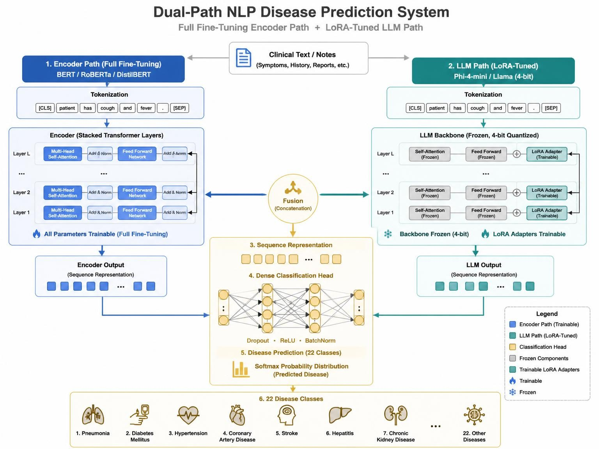
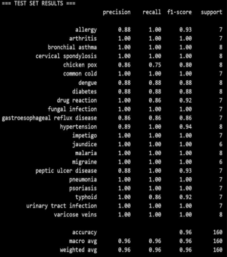
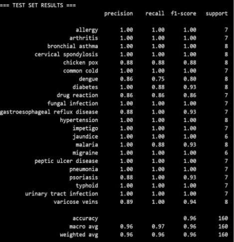
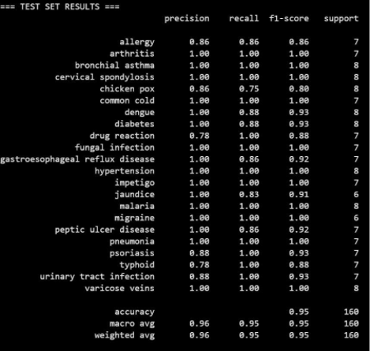
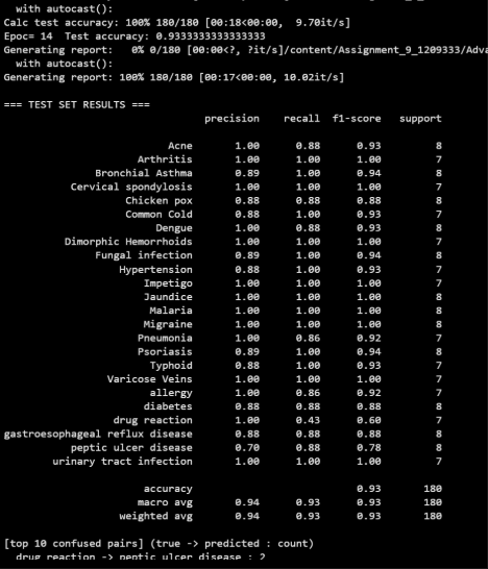
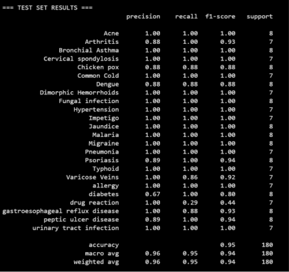
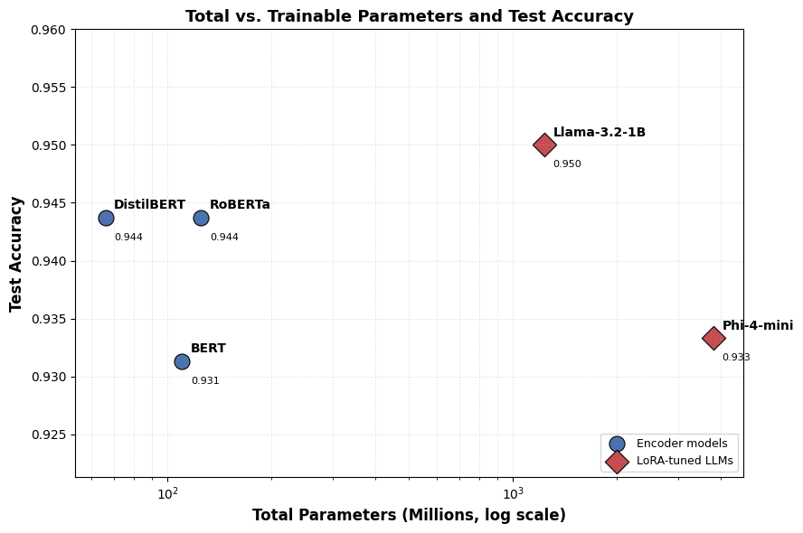
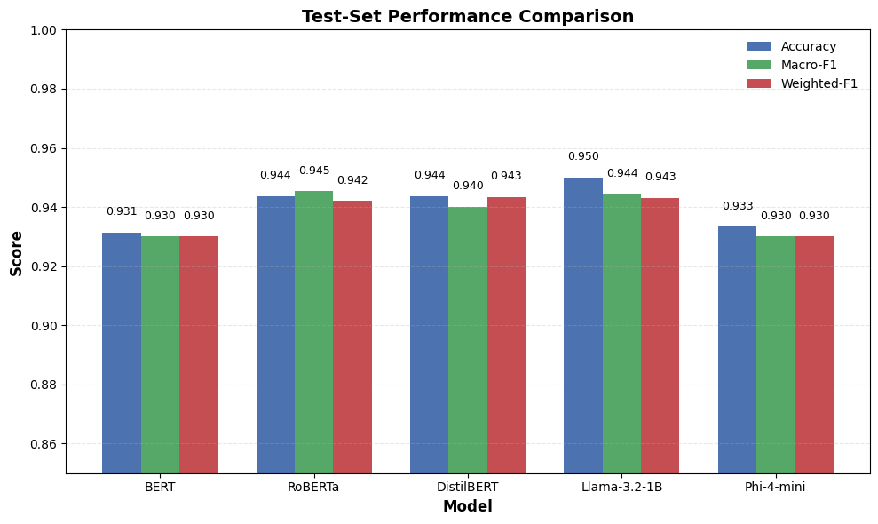
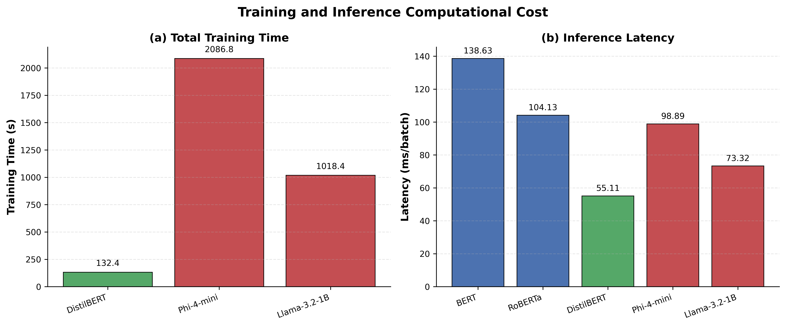

# Fine-Tuning vs LoRA: Symptom-Based Disease Classification

Research implementation comparing **full fine-tuning of encoder-based Transformer models** with **LoRA-based parameter-efficient fine-tuning of decoder-only Large Language Models (LLMs)** for symptom-based disease classification.

## Overview

This project investigates the performance, training efficiency, and parameter efficiency of Transformer-based models for classifying diseases from patient-reported symptoms.

The study compares three encoder models trained using conventional full fine-tuning:

- BERT
- RoBERTa
- DistilBERT

with two decoder-only LLMs adapted using **Low-Rank Adaptation (LoRA)**:

- Phi-4-mini-instruct
- Llama-3.2-1B-Instruct

The experiments evaluate classification accuracy, macro F1-score, training time, and parameter efficiency.

## Research Paper

**Title:**  
Fine-Tuning vs LoRA: Comparing Encoders and Decoder LLMs for Symptom-Based Disease Classification

**Author:**  
Akshay Tanmane

**Advisor:**  
Dr. Ausif Mahmood

**Institution:**  
University of Bridgeport

**Research Area:**  
Natural Language Processing, Large Language Models, Parameter-Efficient Fine-Tuning, Medical Text Classification

## Key Contributions

- Comparative evaluation of encoder-based Transformers and decoder-only LLMs for symptom-based disease classification.
- Evaluation of full fine-tuning versus LoRA-based parameter-efficient fine-tuning.
- Application of **QLoRA with 4-bit NF4 quantization** for decoder-only LLMs.
- Analysis of classification accuracy, macro F1-score, precision, recall, and training efficiency.
- Error analysis of difficult disease categories and symptom descriptions.
- Investigation of the trade-off between model performance, computational cost, and trainable parameters.

## Models

### Encoder Models

The encoder-based models were trained using conventional full fine-tuning.

| Model | Fine-Tuning Method |
|---|---|
| BERT | Full Fine-Tuning |
| RoBERTa | Full Fine-Tuning |
| DistilBERT | Full Fine-Tuning |

### Decoder LLMs

The decoder-only models were adapted using LoRA.

| Model | Fine-Tuning Method |
|---|---|
| Phi-4-mini-instruct | LoRA / QLoRA |
| Llama-3.2-1B-Instruct | LoRA / QLoRA |

## Methodology



The experimental pipeline consists of the following stages:

```text
Symptom Description
        |
        v
Dataset Preparation
        |
        +----------------------+
        |                      |
        v                      v
Encoder Models           Decoder LLMs
        |                      |
 Full Fine-Tuning         LoRA / QLoRA
        |                      |
        +----------+-----------+
                   |
                   v
          Disease Classification
                   |
                   v
       Evaluation & Error Analysis
```

## LoRA Configuration

The decoder models were fine-tuned using a parameter-efficient LoRA configuration.

Key configuration used in the study:

```text
LoRA Rank (r):          8
LoRA Alpha:             16
LoRA Dropout:           0
Quantization:           4-bit NF4
Target Modules:        All Linear Layers
Training Epochs:       15
```

The LoRA approach significantly reduces the number of trainable parameters compared with updating the complete model.

## Dataset

The study uses symptom-based disease classification datasets.

The encoder experiments use a **22-class classification setup**, while the LoRA experiments use a **24-class dataset**.

The LoRA dataset contains:

```text
Training:    840 samples
Validation:  180 samples
Test:        180 samples
```

Additional disease classes included in the LoRA dataset are:

- Acne
- Dimorphic Hemorrhoids

## Results

The experimental results reported in the research paper are summarized below.

| Model | Method | Accuracy |
|---|---|---:|
| BERT | Full Fine-Tuning | 92.50% |
| RoBERTa | Full Fine-Tuning | 94.37% |
| DistilBERT | Full Fine-Tuning | 94.37% |
| Phi-4-mini-instruct | LoRA | 93.33% |
| Llama-3.2-1B-Instruct | LoRA | **95.00%** |

### Model Confusion Matrices & Visualizations

| BERT | RoBERTa |
|:---:|:---:|
|  |  |

| DistilBERT | Phi-4-mini |
|:---:|:---:|
|  |  |

| Llama-3.2-1B |
|:---:|
|  |

### Best Performing Model

Among the evaluated models, **Llama-3.2-1B-Instruct with LoRA achieved 95.00% accuracy** on the reported test set.



RoBERTa and DistilBERT achieved 94.37%, while Phi-4-mini-instruct achieved 93.33%.

## Performance Comparison



The results demonstrate that LoRA-based adaptation of decoder-only LLMs can achieve competitive classification performance while requiring substantially fewer trainable parameters.

The study particularly highlights the trade-off between:

- Classification performance
- Number of trainable parameters
- Training time
- Computational efficiency
- Model architecture



## Error Analysis

The experiments identified difficulties in classifying certain symptom descriptions, particularly cases involving overlapping or ambiguous symptoms.

Drug-reaction-related samples were among the challenging categories observed during evaluation.

This highlights the importance of richer symptom descriptions and larger, more diverse medical datasets for improving model robustness.

## Technologies

```text
Python
PyTorch
Hugging Face Transformers
PEFT
LoRA
QLoRA
BitsAndBytes
Scikit-learn
Pandas
NumPy
Jupyter Notebook
```

## Project Structure

```text
fine-tuning-vs-lora-disease-classification/
│
├── data/
│   ├── train/
│   ├── validation/
│   └── test/
│
├── notebooks/
│   ├── bert_training.ipynb
│   ├── roberta_training.ipynb
│   ├── distilbert_training.ipynb
│   ├── phi4_lora_training.ipynb
│   └── llama_lora_training.ipynb
│
├── src/
│   ├── data_preprocessing.py
│   ├── train_encoder.py
│   ├── train_lora.py
│   └── evaluate.py
│
├── results/
│   ├── metrics/
│   ├── confusion_matrices/
│   └── training_results/
│
├── figures/
│
├── requirements.txt
├── README.md
└── LICENSE
```

## Installation

Clone the repository:

```bash
git clone https://github.com/akshaytanmane150294/fine-tuning-vs-lora-disease-classification.git
cd fine-tuning-vs-lora-disease-classification
```

Create a virtual environment:

```bash
python -m venv .venv
```

Activate the environment.

### Windows

```bash
.venv\Scripts\activate
```

### Linux / macOS

```bash
source .venv/bin/activate
```

Install dependencies:

```bash
pip install -r requirements.txt
```

## Example Workflow

### Encoder Fine-Tuning

```python
from transformers import AutoTokenizer, AutoModelForSequenceClassification

model_name = "bert-base-uncased"

tokenizer = AutoTokenizer.from_pretrained(model_name)

model = AutoModelForSequenceClassification.from_pretrained(
    model_name,
    num_labels=22
)
```

### LoRA Fine-Tuning

The decoder LLM experiments use PEFT-based LoRA adaptation.

```python
from peft import LoraConfig, get_peft_model

config = LoraConfig(
    r=8,
    lora_alpha=16,
    lora_dropout=0.0,
    target_modules="all-linear"
)

model = get_peft_model(model, config)

model.print_trainable_parameters()
```

## Evaluation Metrics

The models are evaluated using:

- Accuracy
- Precision
- Recall
- Macro F1-score
- Training time
- Trainable parameter count

Macro F1 is particularly useful for evaluating multi-class classification performance because it gives equal importance to each class.

## Research Findings

The experiments indicate that:

1. Encoder models remain highly competitive for supervised symptom classification.
2. LoRA enables decoder-only LLMs to achieve strong classification performance without full model fine-tuning.
3. Llama-3.2-1B-Instruct with LoRA achieved the highest reported accuracy of 95.00%.
4. LoRA substantially reduces the number of parameters that need to be updated.
5. Model architecture and fine-tuning strategy both influence accuracy and computational efficiency.
6. Ambiguous symptom descriptions remain a significant source of classification errors.

## Future Work

Potential future directions include:

- Evaluating larger decoder-only LLMs.
- Testing additional parameter-efficient fine-tuning methods.
- Increasing dataset size and diversity.
- Improving handling of ambiguous symptoms.
- Exploring retrieval-augmented generation for medical knowledge.
- Evaluating models on additional medical datasets.
- Investigating quantization and inference optimization.
- Comparing additional PEFT approaches such as AdaLoRA and IA3.

## Reproducibility

For reproducible experiments, the repository should maintain:

- Dataset splits
- Random seeds
- Model checkpoints or model identifiers
- Training configurations
- LoRA configurations
- Evaluation scripts
- Experiment logs
- Hardware and software environment details

## Citation

If you use this work in your research, please cite:

```bibtex
@article{tanmane2026finetuninglora,
  title={Fine-Tuning vs LoRA: Comparing Encoders and Decoder LLMs for Symptom-Based Disease Classification},
  author={Tanmane, Akshay},
  year={2026},
  institution={University of Bridgeport}
}
```

## Author

**Akshay Tanmane**

M.S. Computer Science  
University of Bridgeport

Research interests:

- Artificial Intelligence
- Machine Learning
- Natural Language Processing
- Large Language Models
- Computer Vision
- Parameter-Efficient Fine-Tuning

## License

This repository is intended for academic and research purposes.